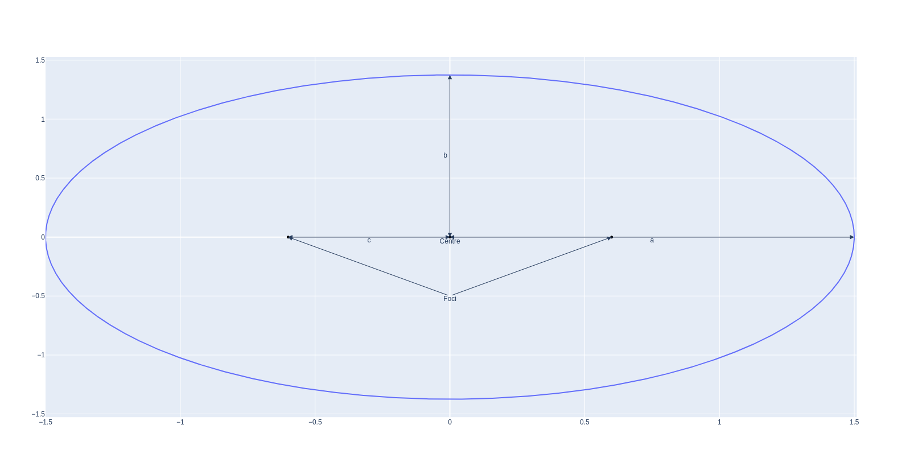
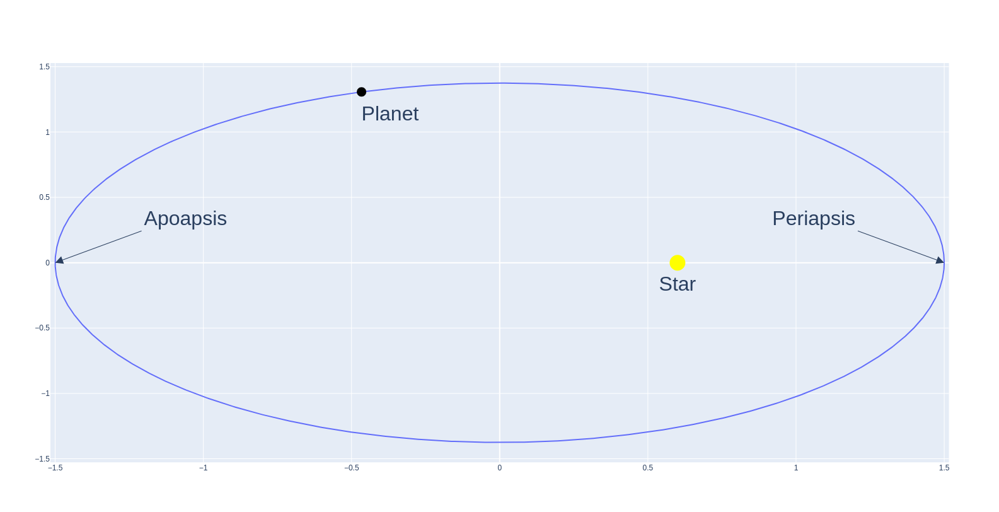
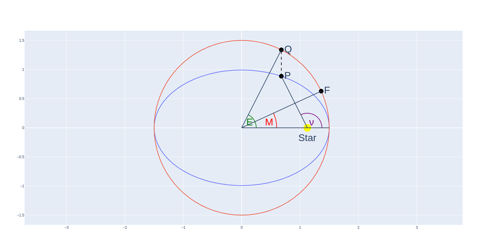

## What is an ellipse?

**Technical definiton of ellipse**: for any point on the ellipse, the sum of
distances to each focus is constant.

See labelled diagram for an ellipse below for the names of the different
components.

- Semi-major axis, $a$
- Semi-minor axis, $b$
- Distance from centre to focus, $c$

The distance from centre to focus, $c$ is geometrically related to the
semi-major and -minor axes by the equation:

$$
c^2 = a^2 - b^2
$$

Here, we can define a new term - the eccentricty $e$ - which is related to $c$
and $a$ by:

$$
c = a e
$$

When $e=0$, then the ellipse is a special case - a circle. Ellipses have
eccentricities $0 \leq e < 1$. Where $e=1$, the ellipse is now unbound and
becomes a parabola, and where $e>1$ the eccentricity is so extreme that we refer
to the generated curve as a hyperbola.

## Elliptical orbits

Planet's have elliptical orbits around their star, which is found at one of the
focus points. Technically, both the star and planet have elliptical orbits
around the system's centre of mass, which is found at the shared focus of every
elliptical orbit of each object in the system. Understanding this is important
for understanding other methods for detecting exoplanets, such as the Doppler
Method. But for our purposes, the star's mass is usually so much greater than
the plantary mass, and the star's orbit so much smaller in comparison to the
planet's orbit, that it is helpful for us to simplify and imagine that the star
is fixed at the focus point of a planet's elliptical orbit around it.

The point on the orbit where the planet is closest to its star is called the
**periapsis**, or when the star is the Sun, it is called the **perihelion**. The
opposite point, where it is furthest from its star, is called the **apoapsis**,
or when the star is the Sun, it is called the **aphelion**.

## Anomalies and Kepler's Second Law

Kepler's Second Law states that a line from an object on an elliptical orbit to
the star at one of its focal points will sweep out equal areas during equal
intervals in time. This basically means that an object moves faster when its
closer to its star, and slower when its further away.

In order to accurately animate orbital motion with Kepler's Second Law, we must
understand elliptical anomalies.

Imagine a circle with radius $a$ centred at the origin.

### Mean Anomaly

Consider a hypothetical planet completing a full orbit in the same time period
$T$ as our real planet on its elliptical orbit.

This hypothetical planet has constant angular speed, described by:

$$
M(t) = \frac{2 \pi t}{T}
$$

The mean anomaly $M$ is the angle from the origin between the periapsis and the
point $F$ on the imaginary orbit for given $t$, when $t=0$ at the periapsis.

### Eccentric Anomaly

Take the point $P$ on the ellipitcal orbit, where the planet actually is at time
$t$, and project upwards to the imaginary circle at point $Q$.

The eccentric anomaly $E$ is the angle from the origin between the periapsis and
point $Q$.

### True Anomaly

True anomaly $\nu$ is simply the angle from the star between the periapsis and
the planet's real position on the ellipitcal orbit at time $t$.

## Computing eccentric anomaly from mean anomaly

# TODO

[Orbital animation](./img/animation.html)
